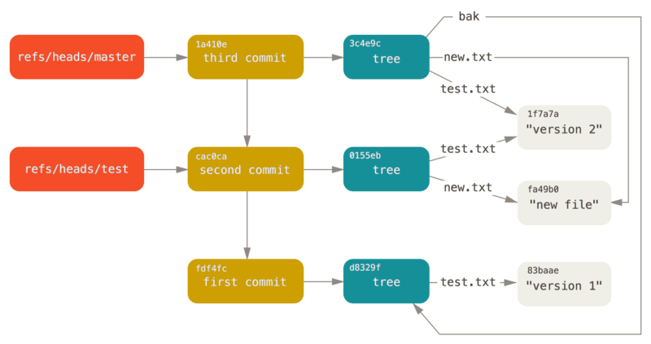

## Basics

* Command line rationale
* Getting to the command line
* Workflow
* Commands
* Expansion and quoting
* Programming constructs
* Help!

## CLI rationale

* Versatility
* Performance
  * Parallelism
  * Efficiency
* Open science
* Availability

## Key concepts

* Break the problem into small well-understood tasks
* Each tool do should do a single thing and do it well
* One form of interface: flat text
    * One record per line
    * Fields split by space or other special character
* Filters

## Typical work-flow

* Fetch
* Select
* Process
* Summarize
* (Plus plumbing and programming)

## Getting to the command line

* Windows: Cygwin + mintty or Windows Subsystem for Linux (WSL)
* Mac OS X: Applications - Utilities - Terminal
* Unix/Linux:  terminal, xterm, rxvt, konsole, kvt, gnome-terminal, nxterm, eterm

## Simple commands

```sh
command

# Input redirection
command <input-file

# Output redirection
command >output-file

# Pipeline
command1 | command2

# Background execution
command &
```

## Variables, expansions

```sh
# Variable assignment
e=expansion

# Variable expansion
$e

# Command expansion
$(command)

# Quoting
'literal string'
"single string with $e"
Literal \$ \' \"

# Wildcards
* ? [abc] [0-9]
```

## Combining commands

```sh
# Sequence
command1 ; command2

# Subshell execution
(command1 ; command2)

# Exit code variable
$?

# Disjunction
command1 || command2

# Conjunction
command1 && command2
```

## Conditional

```sh
if command ; then
  command1
elif command ; then
	command2
else
	command3
fi
```

## While loop

```sh
while command ; do
  commands
done

# Process piped input
while read var ; do
  commands
done
```

## Set loop

```sh
for var in a b c; do
  commands
done
```

## Selection

```sh
case word in
pattern1) list ;;
pattern2) list ;;
esac
```

## Help!

* *command* `--help`
* `man` *command*
* GIYF
* [The Art of the Command Line](https://github.com/jlevy/the-art-of-command-line)

## Workflow: Fetch


## Fetching Git data

* Git internals
* Git commands
* Web and JSON data

## The Git user interface

Git is a content-addressable file system, that happens to be good for versioning
text files. From the user's perspective, Git separates commands in two types:

  * **Porcelain commands:** Contrary to common belief, Git does have a
    user interface. This includes commands such as `commit`, `log`, etc.

  * **Plumbing commands:** Those interact directly with the Git internals,
    for example `cat-file`, `update-ref`, etc.

## Git Internals {- }

At the lowest level Git, is a Key-Value (KV) store, residing on the local
hard drive. For any given input, `git` generates a hash and stores it
into its database. We can interact with Git's KV store, using the
`hash-object` and `cat-file` plumbing commands.

```bash
# Let's write some content in git's store
$ echo "foo" | git hash-object --stdin -w
257cc5642cb1a054f08cc83f2d943e56fd3ebe99

# Verify that it was written
$ find . -type f | grep 56fd3ebe99
./.git/objects/25/7cc5642cb1a054f08cc83f2d943e56fd3ebe99

# Retrieve contents back
git cat-file -p 257cc5642cb1a054f08cc83f2d943e56fd3ebe99
foo
```

## Git Objects {- }

Git supports 3 types of objects in its database:

  * `blobs`, or content objects. Those store raw content
  * `trees` store indices to files
  * `commits` store information about commits, including a link to
    the top level tree the commit represents

```bash
$ git --bare clone https://github.com/ghtorrent/ghtorrent.org && \
  cd ghtorrent.org
$ git cat-file -t 838b2b05e315713791da7e003af9cc80da64658e
tree 6754adb51be5f9d4bee3aeafc7bb67c65396a343
parent af34da36cc381b0da4ec7378ec23b52c31b53145
parent caa91d1b4052a0e34cabe2b415f0f5cf232e8837
author Georgios Gousios <gousiosg@gmail.com> 1517405162 +0100
committer Georgios Gousios <gousiosg@gmail.com> 1517405162 +0100

Merge branch 'italobelo-patch-1'
```

## Tree objects

Tree objects contain links to blob objects or other tree objects.
Each blob object always has a corresponding tree object, otherwise
it is not discoverable.

```bash
$ git cat-file -p 4c2b7a1d59329a3d3a02e9abc5d1e878cf2b07af
100644 blob ae10be1b81757e2127a8328e16b2b2155a64edeb	.gitignore
100644 blob 6904bcdd60efe9315801621c3c36d805f7963148	404.html
100644 blob 7370bac51515903c580df4e946d62cc270eb112c	Gemfile
040000 tree 35dbdb9b45d275393139f03bb86617a6bac75a1a	_bibliography
100644 blob 4103650b66ad802a65afc60a1088e17e06f04cc2	README.md
[...]

$ git cat-file -p 35dbdb9b45d275393139f03bb86617a6bac75a1a
100644 blob 4515579877119d3d026f1a8ed01faa60b43add0a	references.bib

$ git cat-file -p 45155798771
@inproceedings{GPD14,
  author = {Gousios, Georgios and Pinzger, Martin and Deursen, Arie van},
[...]
```

## Commit objects

Commit objects represent a starting point to start navigating a file
tree at a specific version.

```bash
$ git cat-file -t 838b2b05e315713791da7e003af9cc80da64658e
tree 6754adb51be5f9d4bee3aeafc7bb67c65396a343
parent af34da36cc381b0da4ec7378ec23b52c31b53145
parent caa91d1b4052a0e34cabe2b415f0f5cf232e8837
author Georgios Gousios <gousiosg@gmail.com> 1517405162 +0100
committer Georgios Gousios <gousiosg@gmail.com> 1517405162 +0100

Merge
```

_Tags_ are a special type of commit objects: they point to a commit but
has a `tagger` rather than an `author`.

```bash
$ git cat-file -t
```

## References

 Git uses _references_ to give human readable names to important commit
 objects.

```bash
$ find .git/refs -type f
.git/refs/heads/master
.git/refs/heads/pr-51
.git/refs/remotes/origin/HEAD
.git/refs/remotes/origin/master

$ cat .git/refs/heads/master
eb6ba576ec6dd0be077f20ccc47f2269580d6de8
```

Branches are just references.

```bash
$ git branch
* master
  pr-51

$ cat .git/refs/heads/pr-51
b058f06bd69ec7aed7a976c737eb8579904720fd
```

## Putting the pieces together

{width=80%}

The Git object model is a directed graph stored in a KV database,
featuring file system semantics that enable content de-duplication.

## How to implement Git log?

**D:** Given what you know already, how would you implement a rudimentary
version of `git log`?

. . .

```bash

```

## Efficient mining of `git` data

While Git is fast at checking out specific versions to analyze, we
can skip this step all together.

We just need three tools:

  * `show:` To interact with blobs
  * `ls-tree:` To interact with trees
  * `log:` To interact with commits

## Git mining: Typical process

1. Get commits from all branches (`branch`, `log`)
2. Select specific commits to analyze (`log`)
3. Get specific/all files for those commits
4. Process the contents of those files with external tools

## Git `log`: important options

Git `log` walks the git commit graph and prints details from commit
objects. Generally, Git `log` can be configured across 3 dimensions:

  * _where to find commits_: `--all`, `--remotes`
  * _which commits to exclude_: `--author`, `--grep`, `--filename`
  * _what details to print_: `--pretty=<format>`

```bash
# Find commits by moritzbeller, containing an issue reference
# and print their abbreviated SHA and tree SHA
$ git --no-pager log --author moritzbeller@gmx.de --grep "Refs" \
      --pretty="%h %t"
1a4dafcc 89875e32
6b8e79e6 ebb41476
ac4842e1 5107a9d0
[...]
```

## Interacting with trees

Git `ls-tree` prints the contents of a Git tree, identified by its
SHA1. Important options:

  * `-r` Recursive listing of all tree items
  * `--abbrev` Abbreviate hashes (usually 10 is enough)

```bash
$ git ls-tree --abbrev=10 -r aada6ffe | head -n 10
100644 blob 4c05514ff2	.gitignore
100644 blob a5b896487d	.travis.yml
100644 blob 14aa34d8aa	WatchDogCore/Core.iml
100644 blob 1fb2ad661b	WatchDogCore/WatchDog/.classpath
100644 blob a0cb478b8a	WatchDogCore/WatchDog/.project
100644 blob 62492222ad	WatchDogCore/WatchDog/.settings/org.eclipse.jdt.core.prefs
100644 blob f897a7f1cb	WatchDogCore/WatchDog/.settings/org.eclipse.m2e.core.prefs
100644 blob b0a8bfcbcc	WatchDogCore/WatchDog/META-INF/MANIFEST.MF
[...]
```

## Interacting with blobs

Git `show` prints the contents of a blob, identified by its blob SHA. In
that sense, it is similar to `cat-file`

```bash
$ git --no-pager show 841f06d4ee
package nl.tudelft.watchdog.test.timingOutput;

import java.io.ByteArrayOutputStream;
import java.io.UnsupportedEncodingException;
import java.util.Date;
import java.util.LinkedList;
import java.util.List;
[...]
```

## Example workflow

Find sizes for all test file versions in a Java project

```bash
git log --pretty="%h,%t,%ae" |
while read logline; do
  tree=`echo $logline | cut -f2 -d ','`
  git ls-tree --abbrev=10 -r $tree | grep Test.java$ | tr '\t' ' ' |  cut -f3,4 -d ' '
done |
sort |
uniq |
while read testfile; do
  blob=`echo $testfile | cut -f1 -d' '`
  size=`git --no-pager show $blob | wc -l | tr -d ' '`
  echo $testfile $size
done |
sort -k 2
```
. . .

**D:** Do you see how the code above could be improved?

## Example workflow -- better version

We can wrap loops into functions and apply them with `xargs` or `parallel`.
This also makes our code testable.

```bash
function tree_items {
  tree=$(echo $1 | cut -f2 -d ',')
  git ls-tree --abbrev=10 -r $tree | grep Test.java$ | tr '\t' ' ' |  cut -f3,4 -d ' '
}

function file_size {
  blob=$(echo $1 | cut -f1 -d' ')
  echo $1 $(git --no-pager show $blob | wc -l)
}

time git log --pretty="%h,%t,%ae" | parallel tree_items {} |
sort | uniq |
parallel file_size {} |
sort -k 2
```

. . .

**D:** How can we execute this code on 100s of repos?

## Worth knowing
* *find*: select files from checked out projects
* *ssh*: obtain data from remote host
* *mysql*: execute SQL queries on MariaDB / mySQL

## Workflow: Select


## Tools
* grep
* fgrep
* egrep
* awk
* sed
* (cut)
* (jq)
* (xml)

## Regular expressions
* Regular characters: `a`
* Any character: `.`
* Any number of times: `k*`
* Set: `[a-z]`
* Set complement: `[^a-z]`
* Beginning of line: `^a`
* End of line: `b$`
* Escaping: `\.` `\[` `\*`
* Extended: `a|b` `c+` `d?` `{9}` `{,9}`
* Back-references: `(a.b)` `\1`

## Fixed pattern
Obtaining committer timezones
```sh
git blame --line-porcelain readme.md |
fgrep committer-tz |
sort |
uniq -c |
sort -rn |
head -4
```

Result:
```
    270 committer-tz +0700
    228 committer-tz +0200
     50 committer-tz +0100
     14 committer-tz +0000
```

## Simple RE
Assembly language lines in Fourth Research Edition Unix
```sh
git ls-tree -r --name-only Research-V4 sys |
grep '\.s$' |
xargs -I@ git show Research-V4:@ |
wc -l
```

## More complex RE
* Git built-in *grep* command
* Count the number of header include directives
```sh
git grep '^[ \t]*#[ \t]*include.*\.h' Research-V4 |
wc -l
```

## Counting files
```sh
git grep -l '^[ \t]*#[ \t]*include.*\.h' Research-V4 |
wc -l
```

## Counting elements
Number of Makefile files in the second BSD distribution (32)
```sh
git ls-tree -r --name-only BSD-2 -- |
grep -c /makefile\$
```

## Excluding patterns
Number of networks system call **uses** in BSD 4.2
```sh
for i in accept ... socketpair do
  echo -n $i
  # Find system call lines
  git grep -P "\\b$i\\s*\\(" BSD-4_2 |
  # Remove kernel source code
  grep -v :usr/src/sys |
  # Remove noise
  egrep -v '/(games|new|pcc)/' |
  # Count occurrences in C source code
  grep -c ':usr/src.*\.c:'
done |
sort -k3nr
```

## Selecting with awk
* *predicate* `{` *action* `}`
* Any of the two can be missing
* Predicate:
    * Regular expression
    * Arithmetic expression
    * Logical expression
* Auto-splitting into `$`*N*
* Change field separator: `-F,`

## awk example
Contributed subsystems larger than 100 kLoC
```sh
git ls-tree --name-only FreeBSD-release/11.1.0:contrib |
while read d ; do
  echo -n "$d "
  git ls-tree -r --name-only FreeBSD-release/11.1.0:contrib/$d |
  xargs -I@ git show FreeBSD-release/11.1.0:contrib/$d/@ |
  wc -l
done |
awk '$2 > 100000'
```

## sed
* `s/`*RE*`/`*string*`/`
* `/`*pattern*`/`*command*
* `/`*pattern*`/!`*command*
* `n`ext
* `N`ext (append)
* `d`elete
* `p`rint

## sed example
Email domains of Linux pipe.c contributors
```sh
git blame --show-email master -- fs/pipe.c |
sed -n 's/^[^ ]* (<[^@]*@\([^>]*\).*/\1/p' |
sort -u
```

## Workflow: Process


## Tools
* sort
* comm
* join
* tr

## sort
* Ordering
* Grouping
* Top *N* / bottom *N*
* Merging
* Prepare for
    * Set operations
    * Joining

## Useful sort arguments
* `--numeric-sort` or `-n`
* `--reverse` or `-r`
* `--key=2nr` or `-k2nr`
* `--unique` or `-u`
* `--field-separator=:` or `-t`
* `--month-sort` or `-m`

## Grouping and ordering
Top-5 Linux committers
```sh
# Show commit emails
git log --pretty="%ae" |
sort |
# Count consecutive same records
uniq -c |
# Order numerically
sort -rn |
# Obtain top-5
head -5
```

Results:
```
  17317 torvalds@linux-foundation.org
   6679 davem@davemloft.net
   5790 tiwai@suse.de
   4163 viro@zeniv.linux.org.uk
   4111 hsweeten@visionengravers.com
```

## Set operations with comm
* Input: two sorted files
* Output:
    * Records only in first (exclude with `-1`)
    * Records only in second (exclude with `-2`)
    * Common records (exclude with `-3`)
* Performs set difference and intersection

## comm example
How many Linux commits affect both the kernel and drivers?
```bash
# Obtain ordered list of SHA hashes
area_commits()
{
  git log --pretty='%H' master -- $1 | sort
}

# Count common elements
comm -12 <(area_commits kernel) <(area_commits drivers) | wc -l
```

Result: 2213

## join example
Number of commits by same people in Linux and Docker
```bash
# Commits per committer
committer_commits()
{
  git --git-dir=$1 log --pretty='%ae' | sort | uniq -c | sort -k2
}

# Join commits by comitter email
join -j 2 <(committer_commits docker/docker) <(committer_commits torvalds/linux) |
# Order by Docker commits
sort -k3nr |
# Top-5
head -5
```

Result:
```
h.huangqiang@huawei.com 8 129
vgoyal@redhat.com 164 84
vbatts@hashbangbash.com 1 62
hukeping@huawei.com 1 59
sunyuan3@huawei.com 8 38
```

## tr
* Map characters
* To uppercase: `tr a-z A-Z`
* Delete newlines: `tr -d '\n'`
* Complement set: `tr -cs A-Za-z '\n'`
    * This generates a list of words

## tr example
Number of structural change commits
```sh
# Project and file to analyze
cd ReactiveX/RxJava
f=src/main/java/rx/Observable.java

# Obtain list of commit hashes
git log --pretty='%H' 1.x -- $f |
while read sha ; do
  # Show file at given version
  git show $sha:$f |
  # Convert it into structure signature
  tr -cd '{}'
  # Start a new line
  echo
done |
# Obtain unique structures and count them
uniq |
wc -l
```

## Worth knowing
* *tsort*: topological sort
* *gvpr*: graph processing
* *diff*: file difference
* *test*: evaluate predicates
* *expr*: evaluate expressions
* *date*: convert between date formats
* *paste*: paste file records side by side
* *rev*: reverse characters of each line
* *tac*: reverse order of lines in file

## Workflow: Summarize


## Simple tools
* *wc*: count records
* *head*: first *N* records
* *tail*: last *N* records
* *uniq*: unique records

## Summarizing with awk
* Associative arrays
* `BEGIN`, `END` pseudo-predicates

## awk summary example
Count common / total commits in Linux kernel / drivers

```bash
comm -12 <(area_commits kernel) <(area_commits drivers) |
# Sum kernel, driver, and common commits
awk -F$'\t' '
  $1 {k++}
  $2 {d++}
  $3 {c++}
  END {print k + c, d + c, c}'
```

Result:
```
22645 310148 2213
```
Out of 22,645 kernel commits and 310,148 driver commits, only 2,213 are common!

## awk array example
When are the most lines committed?
```sh
# git log with hour and added/removed/file records
git log --date=format:%H --pretty=%ad --numstat |
awk '
  # Keep record of time
  NF == 1 {hour = $1}
  # Accumulate lines added
  NF == 3 {added[hour] += $1}
  END {
    for (i in added)
      print i, added[i]
    }' |
# Order by volume; get top
sort -k 2rn | head -1
```
Result: 15:00 for Linux, 21:00 for FreeBSD, 22:00 for RxJava

## Scaling the analysis

We have to options:

  * Run yet another parallel loop
  * Use `make`

. . .

```bash
function tree_items {...}

function file_size {...}

function per_repo {
  cd $1
  git log --pretty="%h,%t,%ae" |
  parallel tree_items {} |
  sort | uniq |
  parallel file_size {} |
  sort -k 2
}

export -f tree_items file_size per_repo

time ls | parallel per_repo
```

## Making it repeatable with `make`

```Makefile
INPUTS = $(shell find . -type d -name '*.git')
OUTPUTS = $(INPUTS:.git=.ts)

TESTSIZE=/home/gousiosg/repos/testsize

%.ts : %.git
  cd $< && \
  $(TESTSIZE) > ../$(@F)

all: $(OUTPUTS)

clean:
  rm *.ts
```

We use `make` as both a dependency tracker and a parallelisation tool.

```bash
$ make -n    # See what will be run
$ make -j 16 # Run 16 parallel jobs
```

## Mining with `libgit2`/`JGit`

Shell scripting can go a long way, but it has limitations:

* Each step of a pipeline is a process, which must be spawned. Loops can
  be costly.
* Useful data structures (queues, trees) are cumbersome to implement.
* Testing/Debugging can be tricky.

In those cases, we can use `libgit2` or `JGit`, for scripting languages or
Java; we get exactly the same interface, but in a much richer programming
environment.

## Selecting repositories to mine

Generally, we need repositories that are active and representative.
Fortunately, we have datasets such as GHTorrent and RepoReapers available.
We can use the following selection process:

From the whole population:

1. Choose repositories that have forks ($A$)
2. from $A$, exclude repos that were inactive _recently_ ($B$)
2. from $B$, exclude repos that never received a PR ($C$)

On $C$, we can then apply further criteria (e.g. programming language,
build system, minimum number of stars etc).

If the project list is still too long, then apply _stratified sampling_

## GHTorrent queries (1)

Projects that have forks ($A$)

```sql
select distinct(p1.id), u.login, p1.name
from projects p1
  join projects p2 on p1.id = p2.forked_from
  join users u on u.id = p1.owner_id
```

Projects that where active recently ($B$)

```sql
select distinct(p.id), u.login, p.name
from projects p
  join users u on u.id = p.owner_id
  join project_commits pc on pc.project_id = p.id
  join commits c on pc.commit_id = c.id
where c.created_at >= now() - interval 3 month
```

## GHTorrent queries (2)

Projects that never received a PR ($C$)

```sql
select distinct(p.id), u.login, p.name
from projects p
  join users u on u.id = p.owner_id
  join pull_requests pr on pr.base_repo_id = p.id
where c.created_at >= now() - interval 3 month
```

Putting it all together:

```sql
select A.id, A.login, A.name
from A join B on A.id = B.id
  left join C on B.id = C.id
```

## Getting extra information

The selection process will return a list of projects that looks like this:

```csv
project_id, owner, repo
1334,rails,rails
1335,jenkinsm,cellulite
1337,lshift,diffa
1341,CottageLabs,cl
1342,Craga89,qTip2
1345,xforty,vagrant-drupal
```

We might need to get extra information from the GitHub API (e.g. number of
stars, language), to do the selection. This is easy to do with two basic tools:

  * `curl` Retrieves contents from URLs
  * `jq` Query JSON objects

## Obtaining star count

```bash
cat repos.csv | cut -f 2,3 -d ','  | tr ',' '/' |
xargs -I {} curl  -s https://api.github.com/repos/{} |
jq '[.stargazers_count, .language |tostring]|join(", ")' > info.csv

paste -d ',' repos.csv info.csv
```

If your project list is big, you will quickly hit the GitHub API
rate limit. You then need a GitHub API key, which you can provide
to `curl` as follows

```bash
curl -H "Authorization: token OAUTH-TOKEN" -s ...
```

## Cloning the repositories

After we have clarified our selection, we need to clone the repositories.
For this, we will use the Git `bare` format, to minimize space usage.

```bash
cat repos.txt |
cut -f 2,3 -d ',' |
tr ',' '/' |
xargs -I {} -P 8 git clone --bare https://github.com/{}
```

##
