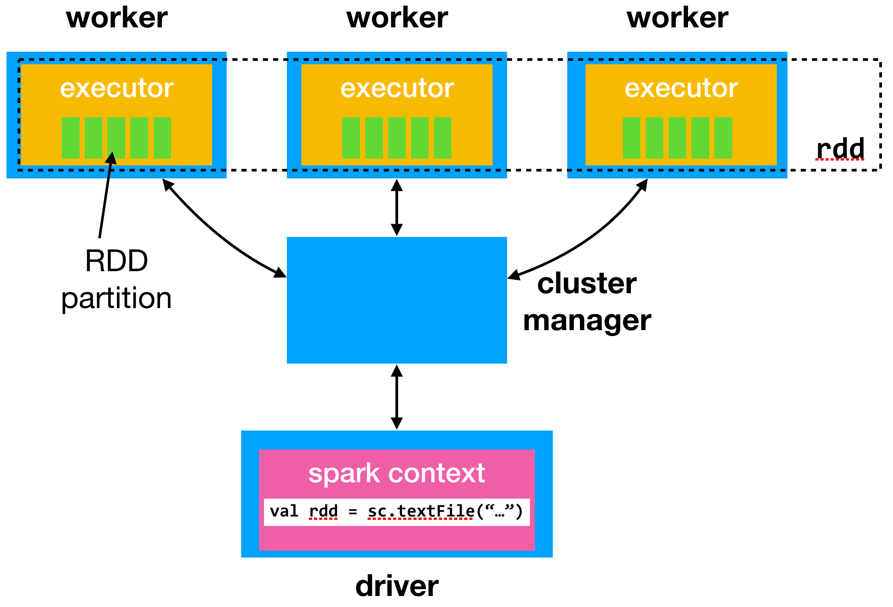

## The tutorial

Welcome! In this tutorial, we will go through the following 3 topics:

* Data processing with functional programming
* Internals of Apache Spark
* Using Apache Spark for common MSR data tasks
* Using Apache Spark for repository mining

## Programming languages

The _de facto_ languages of Big Data and data science are

* **Scala** Mostly used for data intensive systems
* **Python** Mostly used for data analytics tasks

Other languages include

* **Java** The "assembly" of big data systems; the language that most big
data infrastructure is written into.
* **R** The statistician's tool of choice. Great selection of libraries for
serious data analytics, great plotting tools.

In our tutorial, we will be using Scala and Python.

# Data processing with Functional Programming

## Types of data {- }

* **Unstructured**: Data whose format is not known
    - Raw text documents
    - HTML pages

* **Semi-Structured**: Data with a known format.
    - Pre-parsed data to standard formats:
        [JSON](https://api.github.com/events),
        [CSV](https://en.wikipedia.org/wiki/Comma-separated_values),
        [XML](http://www.ecb.europa.eu/stats/eurofxref/eurofxref-daily.xml)

* **Structured**: Data with known formats, linked together in graphs or tables
    - SQL or Graph databases
    - Images

## Sequences / Lists {- }

**Sequences** or **Lists** or **Arrays** represent consecutive items
in memory

In Python:
```python
a = [1, 2, 3, 4]
```

In Scala
```scala
val l = List(1,2,3,4)
```

Basic properties:

- Size is bounded by memory
- Items can be accessed by an index: `a[1]` or `l.get(3)`
- Items can only inserted at the end (_append_)
- Can be sorted

## Sets {- }

Sets store values, without any particular order, and no repeated values.

```scala
scala> val s = Set(1,2,3,4,4)
s: scala.collection.immutable.Set[Int] = Set(1, 2, 3, 4)
```
Basic properties:

- Size is bounded by memory
- Can be queried for containment
- Set operations: union, intersection, difference, subset

## Maps or Dictionaries {- }

**Maps** or **Dictionaries** or **Associative Arrays** is a collection of
`(k,v)` pairs in such a way that each `k` appears only once.

Some languages have build-in support for Dictionaries
```python
a = {'a' : 1, 'b' : 2}
```

Basic properties:

- One key always corresponds to one value.
- Accessing a value given a key is very fast ($\approx O(1)$)

## Nested data types: Graphs {- }

A graph data structure consists of a finite set of vertices or nodes,
together with a set of unordered pairs of these vertices for an undirected graph
or a set of ordered pairs for a directed graph.

* Nodes can contain attributes
* Vertices can contain weights and directions

Graphs are usually represented as `Map[Node, List[Vertex]]`, where

```scala
case class Node(id: Int, attributes: Map[A, B])
case class Vertex(a: Node, b: Node, directed: Option[Boolean],
                  weight: Option[Double] )
```

## Nested data types: Trees {- }

Ordered graphs without loops

```python
a = {"id": "5542101946", "type": "PushEvent",
    "actor": {
      "id": 801183,
      "login": "tvansteenburgh"
    },
    "repo": {
      "id": 42362423,
      "name": "juju-solutions/review-queue"
   }}
```

If we parse the above JSON in almost any language, we get a
series of nested maps

```scala
Map(id -> 5542101946,
    type -> PushEvent,
    actor -> Map(id -> 801183.0, login -> tvansteenburgh),
    repo -> Map(id -> 4.2362423E7, name -> juju-solutions/review-queue)
)
```

## Relations {- }

An $n$-tuple is a sequence of $n$ elements, whose types are known.

```scala
val record = Tuple4[Int, String, String, Int]
                   (1, 'Georgios', 'Mekelweg', '4')
```

A _relation_ is a `Set` of n-tuples $(d1, d2, ..., dn)$.

Relations are very important for data processing, as they form the theoretical
framework ([Relational Algebra](https://en.wikipedia.org/wiki/Relational_algebra))
for _relational (SQL) databases_.

Typical operations on relations are insert, remove and _join_. Join allows us
to compute new relations by joining existing ones on common fields.

## Key/Value pairs {- }

A key/value pair (or KV) is a special type of a Map, where a key `k` does
not have to appear once.

Key/Value pairs are usually implemented as a `Map` whose keys are of a sortable
type `K` (e.g. `Int`) and values are a `Set` of elements of type `V`.

```scala
val kv = Map[K, Set[V]]()
```

Another way to represent a K/V pair is a `List` of n-tuples $(d1, d2, ..., dn)$.

K and V are flexible: that's why the Key/Value abstraction is key to
NoSQL databases, including MongoDB, DynamoDB, Redis etc. Those databases
sacrifice, among others, type safety for scaling.

## Functional programming {- }

Functional programming is a programming paradigm that treats computation as the
evaluation of mathematical functions and avoids changing-state and mutable data
(Wikipedia).

Functional programming characteristics:

* Absence of **side-effects**: A function, given an argument, always returns
 the same results irrespective of and without modifying its environment.
* **Higher-order functions**: Functions can take functions as arguments to
 parametrise their behavior
* **Lazyness**: The art of waiting to compute till you can wait no more

## Function signatures {- }

$foo(x: [A], y: B) \rightarrow C$

* $foo$: function name
* $x$ and $y$: Names of function arguments
* $[A]$ and $B$: Types of function arguments.
* $\rightarrow$: Denotes the return type
* $C$: Type of the returned result
* $[A]$: Denotes that type $A$ can be traversed

We read this as: _Function foo takes as arguments an array/list of type A and an
argument of type B and returns an argument of type C_

**Q**: _What does the following function signature mean?_
$f(x:[A], y:(z: A) \rightarrow B) \rightarrow [B]$

## Side effects {- }

A function has a side effect if it **modifies** some state outside its scope or
has an observable interaction with its calling functions or the outside world
besides returning a value.

```python
max = -1

def ge(a, b):
    global max
    if a >= b:
        max = a ## <- Side effect!
        return True
    else:
        max = b
        return False
```

As a general rule, any function that returns nothing (`void` or `Unit`) does
a side effect!

## Examples of side effects {- }

* Setting a field on an object: OO is not FP!
* Modifying a data structure in place: In FP, data structures are always [persistent](https://en.wikipedia.org/wiki/Persistent_data_structure).
* Throwing an exception or halting with an error: In FP, we use types that
encapsulate and propagate erroneous behaviour
* Printing to the console or reading user input, reading writing to files or
the screen: In FP, we encapsulate external resources into _Monads_.

## Higher-Order functions {- }

A higher order function is a function that can take a function
as an argument or return a function.

```scala
class Array[A] {
  // Return elements that satisfy f
  def filter(f: A => Boolean) : Array[A]
}
```

In the context of BDP,
high-order functions capture common idioms of processing data as enumarated
elements, e.g. going over all elements, selectively removing elements and
aggregating them.

---

## Important higher-order functions

`map(xs: [A], f: A => B) : [B]`

: Applies `f` to all elements and returns a new list.

`flatMap(xs: [A], f: A => [B]) : [B]`

: Like `map`, but flattens the result to a single list.

`fold(xs: [A], f: (B, A) => B, init: B) : B`

:  Takes `f` of 2 arguments and an init value and combines the elements by applying `f` on the result of each previous application. AKA `reduce`.

## Aux higher-order functions

`groupBy(xs: [A], f: A => K): Map[K, [A]]`

: Partitions `xs` into a map of traversable collections according to some discriminator function.

`filter(xs: [A], f: A => Boolean) : [A]`

: Takes a function that returns a boolean and returns all elements that satisfy it

`zip(xs: [A], ys: [B]): [(A,B)]`

: Returns a iterable collection formed by iterating over the corresponding
items of `xs` and `ys`.

## `foldL` and `foldR`

`foldL(xs: [A], f: (B, A) => B, init: B) : B`

`foldR(xs: [A], f: (A, B) => B, init: B) : B`

Both take almost the same agruments and return the same results. What is the
difference in their evaluation?

```{python print_reduce, eval=F, echo=F}
def reduceR(func, xs, init):
  return reduce(lambda x,y: func(y,x), reversed(xs), init)

def reduce_pp(acc, x):
  return "(%s + %s)" % (acc, x)
```

How does `foldL` work?

```{python reduceLEval, eval=F}
print reduce(reduce_pp, range(1,10), 0)
```

```{python, ref.label=c('print_reduce', 'reduceLEval'), echo=F}
```

How does `foldR` work?

```{python reduceREval, eval=F}
print reduceR(reduce_pp, range(1,10), 0)
```
```{python, ref.label=c('reduceR', 'print_reduce', 'reduceREval'), echo=F}
```

## Laziness {- }

_Laziness_ is an evaluation strategy which delays the evaluation of an
expression until its value is needed.

* Seperating a pipeline construction from its evaluation
* Not requiring to read datasets in memory: we can process them in lazy-loaded batches
* Generating _infinite_ collections
* Optimising execution plans

```{python primes}
def primes(limit):
  sieve = [False]*limit

  for j in xrange(2, limit):
    if sieve[j]: continue
    yield j
    if j*j > limit: continue
    for i in xrange(j, limit, j):
      sieve[i] = True

print [x for x in primes(100)][1:10]
```
# Apache Spark

## What is Spark? {- }

Spark is on open source cluster computing framework.

* automates distribution of data and computations on a cluster of computers
* provides a fault-tolerant abstraction to distributed datasets
* is based on functional programming primitives
* provides two abstractions to data, list-like (RDDs) and table-like (Datasets)

## Resilient Distributed Datasets (RDDs) {- }

RDDs are the core abstraction that Spark uses.

RDDs make datasets distributed over a cluster of machines look like a Scala
collection. RDDs:

* are immutable
* reside (mostly) in memory
* are transparently distributed
* feature all FP programming primitives
  * in addition, more to minimize shuffling

In practice, `RDD[A]` works like Scala's `List[A]`, with some gotchas

## Counting words with Spark {- }

```scala
val rdd = sc.textFile("./datasets/odyssey.mb.txt")
rdd.
  flatMap(l => l.split(" ")).       // Split file in words
  map(x => (x, 1)).                 // Create key,1 pairs
  reduceByKey((acc, x) => acc + x). // Count occurences of same pairs
  sortBy(x => x._2, false).         // Sort by number of occurences
  take(50).                         // Take the first 50 results
  foreach(println)
```

The same code works on one computer on a cluster of 100s of computers.

## How to create an RDD? {- }

RDDs can only be created in the following 3 ways

1. Reading data from external sources

```scala
val rdd1 = sc.textFile("hdfs://...")
val rdd2 = sc.textFile("file://odyssey.txt")
val rdd3 = sc.textFile("s3://...")
```

. . .

2. Convert a local memory dataset to a distributed one

```scala
val xs: Range[Int] = Range(1, 10000)
val rdd: RDD[Int] = sc.parallelize(xs)
```
. . .

3. Transform an existing RDD

```scala
rdd.map(x => x.toString) //returns an RDD[String]
```

## RDDs are lazy! {- }

There are two types of operations we can do on an RDD:

* **Transformation:** Applying a function that returns a new RDD. They are _lazy_.

* **Action:** Request the computation of a result. They are _eager_.

```scala
// This just sets up the pipeline
val result = rdd.
  flatMap(l => l.split(" ")).
  map(x => (x, 1))

// Side-effect, triggers computation
result.foreach(println)
```

## Examples of RDD transformations {- }

All uses of articles in the Odyssey

```scala
val odyssey = sc.textFile("datasets/odyssey.mb.txt").
                 flatMap(_.split(" "))

odyssey.map(_.toLowerCase).
        filter(Seq("a", "the").contains(_))
```

**Q:** How can we find uses of all regular verbs in past tense?

. . .
```scala
odyssey.filter(x => x.endsWith("ed"))
```

**Q:** How can we remove all punctuation marks?

. . .
```scala
odyssey.map(x => x.replaceAll("\\p{Punct}|\\d", ""))
```

## Common actions on `RDD[A]` {- }

`collect`: Return all elements of an RDD

: $RDD.collect() : Array[A]$

. . .

`take`: Return the first _n_ elements of the RDD

: $RDD.take(n): Array[A]$

. . .

`reduce`, `fold`: Combine all elements to a single result of the same time.

: $RDD.reduce(f: (A, A) \rightarrow A): A$

. . .

`aggregate`: Aggregate the elements of each partition, and then the results for all the partitions

: $RDD.aggr(init: B)(seqOp: (B, A) \rightarrow B, combOp: (B, B) \rightarrow B): B$

## Examples of RDD actions {- }

How many words are there?

```scala
val odyssey = sc.textFile("datasets/odyssey.mb.txt").flatMap(_.split(" "))

odyssey.map(x => 1).reduce((a,b) => a + b)
```

How can we sort the RDD?

```scala
odyssey.sortBy(x => x)
```

How can we sample data from the RDD?

```scala
val (train, test) = odyssey.randomSplit(Array(0.8, 0.2))
```
## Pair RDDs {- }
RDDs can represent any complex data type, if it can be iterated.
Spark treats RDDs of the type `RDD[(K,V)]` as special, named PairRDDs, as
they can be both iterated and indexed.

Operations such as `join` are only defined on Pair RDDs.

We can create Pair RDDs by applying an indexing function or by grouping records:

```scala
val rdd = List("foo", "bar", "baz").parallelize // RDD[String]
val pairRDD = rdd.map(x => (x.charAt(0), x))  // RDD[(Char, String)]
pairRDD.collect
// Array((f,foo), (b,bar), (b,baz))
val pairRDD2 = rdd.groupBy(x => x.charAt(0))  // RDD[(Char, Iterable(String))]
pairRDD2.collect
//Array((b,CompactBuffer(bar, baz)), (f,CompactBuffer(foo)))
```

## Transformations on Pair RDDs {- }
The following functions are only available on `RDD[(K,V)]`

`reduceByKey`: Merge the values for each key using an associative and commutative reduce function

: $reduceByKey(f: (V, V) \rightarrow V): RDD[(K, V)]$

. . .

`aggregateByKey`: Aggregate the values of each key, using given combine functions and a neutral "zero value"

: $aggrByKey(zero: U)(f: (U, V) \rightarrow U, g: (U, U) \rightarrow U): RDD[(K, U)]$

. . .

`join`: Return an RDD containing all pairs of elements with matching keys

: $join(b: RDD[(K, W)]): RDD[(K, (V, W))]$

## Pair RDD example: `aggregateByKey` {- }

How can we count the number of occurrences of part of speach elements?

```scala
object PartOfSpeach {
  sealed trait EnumVal
  case object Verb extends EnumVal
  case object Noun extends EnumVal
  case object Article extends EnumVal
  case object Other extends EnumVal
  val partsOfSpeach = Seq(Verb, Noun, Article, Other)
}

def partOfSpeach(w: word): PartOfSpeach = ...

odyssey.groupBy(partOfSpeach).
        aggregateByKey(0)((acc, x) => acc + 1,
                          (x, y) => x + y)
```

**D:** What type conversions take place here?

## Pair RDD example: `join` {- }

```scala
case class Person(id: Int, name: String)
case class Addr(id: Int, person_id: Int,
                address: String, number: Int)

val pers = sc.textFile("pers.csv") // id, name
val addr = sc.textFile("addr.csv") // id, person_id, street, num

val ps = pers.map(_.split(",")).map(Person(_(0).toInt, _(1)))
val as = addr.map(_.split(",")).map(Addr(_(0).toInt, _(1).toInt,
                                         _(2), _(3).toInt))
```

**Q:** What are the types of `ps` and `as`? How can we join them?

. . .

```scala
val pairPs = ps.keyBy(_.id)
val pairAs = as.keyBy(_.person_id)

val addrForPers = pairAs.join(pairPs) // RDD[(Int, (Addr, Person))]
```

## Spark SQL

In Spark SQL, we trade some of the freedom provided by the RDD API to enable:

* declarativity, in the form of SQL
* automatic optimizations, similar to ones provided by databases
    * execution plan optimizations
    * data movement/partitioning optimizations

The price we have to pay is to bring our data to a (semi-)tabular format and
describe its schema. Then, we let relational algebra work for us.

## Spark SQL basics {- }

SparkSQL is a library build on top of Spark RDDs. It provides two main
abstractions:

* Datasets, collections of strongly-typed objects. Scala/Java only!
* Dataframes, essentially a `Dataset[Row]`, where `Row` $\approx$ `Array[Object]`.
  Equivalent to R or Pandas Dataframes
* SQL syntax

It can directly connect and use structured data sources (e.g. SQL databases)
and can import CSV, JSON, Parquet, Avro and data formats
by inferring their schema.

## Creating Data Frames and Datasets

1. From RDDs containing tuples, e.g. `RDD[(String, Int, String)]`

```scala
import spark.implicits._

val df = rdd.toDF("name", "id", "address")
```

2. From RDDs with known complex types, e.g. `RDD[Person]`

```scala
val df = persons.toDF() // Columns names/types are infered!
```

---

3. From RDDs, with manual schema definition

```scala
val schema = StructType(Array(
  StructField("level", StringType, nullable = true),
  StructField("date", DateType, nullable = true),
  StructField("client_id", IntType, nullable = true),
  StructField("stage", StringType, nullable = true),
  StructField("msg", StringType, nullable = true),
))

val rowRdd = sc.textFile("ghtorrent-log.txt").
                map(_.split("#")).
                map(r => Row(r(0), new Date(r(1)), r(2).toInt,
                             r(3), r(4)))

val logDF = spark.createDataframe(rowRDD, schema)
```

4. By reading (semi-)structured data files

```scala
val df = spark.read.json("examples/src/main/resources/people.json")
```

```python
df = sqlContext.read.csv("/datasets/pullreqs.csv", sep=",",
                          header=True, inferSchema=True)
```

## Spark cluster architecture {- }

{width=50%}

* _Executors_ do the actual processing; _worker_ nodes can contain multiple executors.
* The _driver_ accepts user programs and returns processing results
* The _cluster manager_ does resource allocation

# Using Spark for structured data

## Spark as an efficient Pandas/R backend

While R and Python are handy with small CSV files, they can be
very slow when the number of CSV file lines reaches $10^6$.

Spark offers a very versatile structured data framework and
can act as an efficient backend for:

* Interactive exploration
* Ad-hoc querying and joing structured data
* Machine learning applications

## Our running example: Pull Requests!

```python
from pyspark.sql.types import *
from pyspark.sql.functions import *
from pyspark.sql import SQLContext

sqlContext = SQLContext(sc)

df = sqlContext.read.csv("hdfs://athens:8020/pullreqs.csv",
                         sep=",", header=True, inferSchema=True).\
                     cache()

sqlContext.registerDataFrameAsTable(df, "pullreqs")
```

The dataset we are using is from [Gousios and Zaidman, 2014](https://drive.google.com/open?id=0B9Rx0uhucsroV196OEp5VGhzSkU)

## Running SQL queries

Listing projects

```python
sqlContext.sql("select distinct(project_name) from pullreqs").show(10)
```

Check how PRs are merged

```python
sqlContext.sql("""select merged_using, count(*) as occurences
                  from pullreqs
                  group by merged_using
                  order by occurences desc""").show()

+--------------------+----------+
|        merged_using|occurences|
+--------------------+----------+
|              github|    364528|
|   commits_in_master|    342339|
|             unknown|    138566|
|  merged_in_comments|     29273|
|commit_sha_in_com...|     23234|
|     fixes_in_commit|     18125|
+--------------------+----------+
```

## Nested SQL queries

Queries can be complicated. Here we use a nested query to get the projects per
programming language.

```python
sqlContext.sql("""select lang, count(*) as num_projects
                  from (
                      select distinct(project_name), lang
                      from pullreqs
                  ) as project_langs
                  group by lang""").show()

+----------+------------+
|      lang|num_projects|
+----------+------------+
|javascript|        1726|
|    python|        1518|
|      ruby|        1086|
|      java|        1075|
|     scala|         138|
+----------+------------+
```

## Joining across data sources

Suppose we would like to get some more info about the PR mergers from
GHTorrent.

```python
users = sqlContext.read.format("jdbc").options(
          url='jdbc:mysql://munich/ghtorrent?&serverTimezone=UTC',
          driver='com.mysql.jdbc.Driver',
          dbtable='users',
          user='ght', password='ght',
          partitionColumn = "id",
          numPartitions = "56",
          lowerBound = "0", upperBound = "40341639").\
          load().cache()

sqlContext.registerDataFrameAsTable(users, "users")
```

What is important here is partitioning: this will split the MySQL table
in `numPartitions` partitions and allow for parallel processing of the data.
If the table is small, `cache()`-ing it will help performance tremendously.

## Joining data sources
```python
sqlContext.sql("""select distinct(u.id), u.login, u.country_code
                from users u join pullreqs pr on u.login = pr.merger
                where country_code != 'null'""").show(10)
```

This returns the expected results, even though the data resides in 2
(very) different sources.

```
+-------+----------------+------------+
|     id|           login|country_code|
+-------+----------------+------------+
|2870788|Bernardstanislas|          fr|
|1136167|CamDavidsonPilon|          ca|
|  35273|      DataTables|          gb|
|2955396|         Drecomm|          nl|
|2468606|      Gaurang033|          in|
|2436711|         JahlomP|          gh|
|8855272|     JonnyWong16|          ca|
| 624345|          M2Ys4U|          gb|
|1185808|         PierreZ|          fr|
+-------+----------------+------------+
```

## Exporting to Pandas/R

Spark only offers basic statistics;
fortunately, we can easily export data to Pandas/R.

```python
import pandas as pd

pandas_df = sqlContext.sql(
  """select project_name, count(*) as num_prs
     from pullreqs
     group by project_name""").toPandas()

pandas_df.describe()

---
            num_prs
count   5543.000000
mean     165.265199
std      407.276860
min        1.000000
25%       60.000000
50%       85.000000
75%      150.000000
max    17630.000000
```

## Machine learning with Spark

Spark has very nice [Machine learning library](https://spark.apache.org/docs/latest/ml-guide.html). The general idea is that we need to bring our
data in a format that MLlib understands and then we can fit and evaluate
several ready-made algorithms.

The reshaping process composes of:

* Converting factors to use OneHot encoding
* Converting booleans to integers
* Creating training and testing datasets

The transformations are always done on DataFrames, in a pipeline fashion.

We also need to specify an evaluation function.

## Data preparation examples

One Hot encoding for factors

```python
# Convert feature columns to a numeric vectors
onehot = VectorAssembler(inputCols=feature_cols, outputCol='features')
```

Defining a transformation pipeline

```python
pipeline = Pipeline(stages=[onehot])
allData = pipeline.fit(df).transform(df).cache()
```

Creating train and test datasets

```python
(train, test) = allData.randomSplit([0.9, 0.1], seed=42)
```

## Our evaluation function

```python
from pyspark.ml.evaluation import BinaryClassificationEvaluator

## Calculate and return the AUC metric
def evaluate(testData, predictions):
    evaluator = BinaryClassificationEvaluator(labelCol="merged_int",
                                              rawPredictionCol="rawPrediction")
    print "AUC: %f" % evaluator.evaluate(predictions)
```

We just compare classifiers based on AUC

## Random Forests and Gradient Boosting

```python
from pyspark.ml.classification import RandomForestClassifier as RF
from pyspark.ml.evaluation import BinaryClassificationEvaluator

rf = RF(labelCol='merged_int', featuresCol='features',
        numTrees=100, maxDepth=5)
rfModel = rf.fit(train)
evaluate(testData, rfModel.transform(test))
```
AUC is 0.780482

```python
from pyspark.ml.classification import GBTClassifier

gbt = GBTClassifier(maxIter=10, maxDepth=5,
                    labelCol="merged_int", seed=42)
gbtModel = gbt.fit(trainingData)
evaluate(testData, gbtModel.transform(testData))
```
AUC is 0.792181

# Mining repositories with Spark

## The source{d} MSR stack

source{d} is a start up that develops tools for doing research on
Big Code:

* The [Public Git Archive](https://pga.sourced.tech) is a dataset containing
all GitHub repos with more than 50 stars
* [Engine](https://github.com/src-d/engine) is a Spark plugin that
enables access to multiple git repos

## Downloading data: The Public Git Archive

The [Public Git Archive](https://pga.sourced.tech) is a dataset containing
all GitHub repos with more than 50 stars. It comes with a cmd line tool,
`pga`, which allows users to selectively download repos in the custom
`siva` format, which is suitable for use on HDFS.

```bash
$ pga list -u incubator |wc -l
   1251
$ pga get -u incubator         # Retrieve data
$ hadoop fs -put incubator /  # Put data to HDFS
```

## Using the source{d} engine

```scala
import tech.sourced.engine._

val engine = Engine(spark, "hdfs://athens:8020/incubator/latest/*/", "siva")
val repos = engine.getRepositories
val commits = engine.getRepositories.getReferences.getAllReferenceCommits

repos.createOrReplaceTempView("repos")
commits.createOrReplaceTempView("commits")
```

## Running arbitrary queries

Seeing how many repos we have

```scala
spark.sql("select count(*) from repos").show(10, false)
```

Commits per repo
```scala
spark.sql("select repository_id, count(*)
           from commits
           group by repository_id
           order by count(*) desc").show(10, false)
```

## Filtering files

# Further reading

## References

If you are interested in Big Data Processing, you might want to
have a look to my [Big Data Processing](http://gousios.org/courses/bigdata/) course at TU Delft.


This work is (c) 2017 - onwards by Georgios Gousios and licensed
under the [Creative Commons Attribution-NonCommercial-ShareAlike 4.0
International](http://creativecommons.org/licenses/by-nc-sa/4.0/) license.
